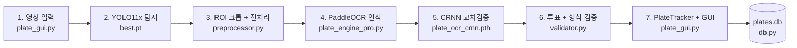

# YOLO11 — 한국 차량 번호판 인식 파이프라인

YOLO11x 객체 탐지 + PaddleOCR + CRNN 교차검증 기반의 한국 차량 번호판 실시간 인식 시스템.
정적 이미지 회귀 테스트 **11/12 (91.7%)** — 실패 케이스 1건을 README에 공개합니다. 실시간 영상 Ghost Detection 방지.

---

## 데모


<!-- 데모 GIF 생성 방법 -->
```bash
# result_portfolio.mp4에서 10초 GIF 추출
ffmpeg -ss 5 -t 10 -i result_portfolio.mp4 -vf "fps=10,scale=720:-1:flags=lanczos" docs/demo.gif
```

> (아직 GIF 미생성. `result_portfolio.mp4`는 `.gitignored`. 위 명령으로 `docs/demo.gif` 만들면 README가 자동 표시됨)

---

## 셀링 포인트

> **YOLO11x + PaddleOCR + CRNN 3-tier 검증 파이프라인 · 3대 God class 모놀리스(7,648줄) → 10개 도메인 모듈 SRP 분해(-44%) · 정적 회귀 11~12/12 무손실 유지 · `src/` 패키지 + GitHub Actions CI + 4종 문서 체계.**

이력서 한 줄: *한국 번호판 OCR 파이프라인 7단계 설계 및 SRP 기반 모듈화(-3,353줄, 10개 도메인 모듈) — 회귀 baseline 무손실, PEP 562 lazy re-export + 헬퍼 클래스 패턴으로 공개 API 100% 보존.*

---

## 아키텍처

7단계 파이프라인을 **단일 책임 원칙(SRP)** 으로 모듈화. 비대해진 `plate_engine_pro.py`에서 전처리 / 형식 검증 / DB 책임을 신규 3개 모듈로 분리하고, 엔진 본체는 orchestrator로 축소.



| 모듈 | 줄 수 | 책임 |
|------|------:|------|
| `src/yolo11_plate/plate_engine_pro.py` | **2,721** | 엔진 orchestrator — YOLO 2-Stage · OCR · CRNN · 투표 · 트래킹 |
| `src/yolo11_plate/preprocessor.py` | 282 | `ImagePreprocessor` — 22종 정적 전처리 (`OCRConfig.PREPROCESS_METHODS` 디스패치) |
| `src/yolo11_plate/validator.py` | 205 | `PlateValidator` — 한국 번호판 정규식 · 길이 · 한글 보정 |
| `src/yolo11_plate/db.py` | 115 | `PlateDatabase` — SQLite 인식 이력/수배 |

> 📘 깊이 있는 설계 노트(데이터 플로우, 캐시 전략, CRNN 패치)는 [`docs/ARCHITECTURE.md`](docs/ARCHITECTURE.md) 참고 (작성 중).

---

## 파이프라인 (7단계)

```
[1] 영상 입력 → [2] YOLO11x 탐지 → [3] ROI 크롭 + 18종 전처리
→ [4] PaddleOCR 인식 → [5] CRNN 교차검증
→ [6] 위치 기반 투표 + 형식 검증 → [7] PlateTracker 추적 + GUI 출력
```

### 1단계 — 영상 입력
프레임 캡처. 파일 영상(`movie/hiway.mp4`) 또는 라이브 캠 스트림.

| 항목 | 값 |
|------|----|
| 입력 해상도 | 1920×1080 권장 (4K 지원) |
| 프레임 처리 | OpenCV `VideoCapture` |
| 진입점 | `plate_gui.py` |

### 2단계 — YOLO11x 번호판 탐지
번호판 위치를 bounding box로 탐지.

| 항목 | 값 |
|------|----|
| 모델 | `best.pt` (YOLO11x fine-tuned) |
| mAP@50 | 98.4% — **학습 시 internal validation 기준**. 외부 검증 데이터셋 없음. |
| NMS | Ultralytics 기본값(IoU 0.7) — `plate_engine_pro.py`에 explicit 미설정 |
| 최소 박스 크기 | 폭 35px / 높이 16px (`config.py:202-203`) |
| 종횡비 필터 | 2.0 ≤ w/h ≤ 6.0 (`PLATE_MIN/MAX_ASPECT`) |
| 면적 비율 상한 | 프레임의 8% (`PLATE_MAX_AREA_RATIO`) |

### 3단계 — ROI 크롭 + 18종 전처리
탐지 박스를 잘라낸 뒤 OCR이 잘 읽도록 18가지 방식으로 변형.

| 항목 | 값 |
|------|----|
| 크롭 마진 | 좌우 35%, 상하 40% |
| 업스케일 | 500px |
| 전처리 종류 | 원본, 흑백, CLAHE, 샤프닝, 이진화, 컬러 채널별 등 18종 |
| 목적 | 조명·각도·해상도 변동에 대한 robustness 확보 |

### 4단계 — PaddleOCR 문자 인식
한국어 특화 PaddleOCR로 18장 전처리 이미지 각각에 대해 OCR 수행.

| 항목 | 값 |
|------|----|
| 모델 | PaddleOCR (한국어 단독) |
| 신뢰도 필터 | 0.40 이상만 후보 채택 |
| 출력 | 18개의 (text, confidence) 후보 |

### 5단계 — CRNN 교차검증
PaddleOCR이 잘 틀리는 한글 부분(`나↔라`, `버↔아` 등)을 CRNN으로 재판독.

| 항목 | 값 |
|------|----|
| 모델 | `plate_ocr_crnn.pth` (10.5M params) |
| 구조 | CNN(6블록) + BiLSTM(2층) + CTC |
| 학습 | 실제 132장 × 10증강(1,320) + 합성 20,647장 = **21,967 샘플** / 200 epoch / RTX 4060 |
| 검증 | 131/132 (99%) |
| 부가 기능 | 2줄 번호판(구형) 지역명 복원 |

### 6단계 — 위치 기반 투표 + 형식 검증
자릿수별 독립 투표 후 한국 번호판 규칙으로 최종 확정.

| 컴포넌트 | 역할 |
|----------|------|
| 위치 기반 분해 투표 | 자릿수마다 18개 후보 중 다수결 (예: 15/18이 `7` → `7` 확정) |
| `PlateValidator` | 한국 번호판 형식(7자리/2줄) 검증 |
| `HangulClassifier` | 초성 기준 한글 교차검증 |

### 7단계 — PlateTracker 추적 + GUI 출력
같은 차량의 번호판을 프레임 간 IoU로 묶어 안정화하고 화면에 표시.

| 항목 | 값 |
|------|----|
| 매칭 | IoU 기반 트랙 + 텍스트 기반 트랙 병합 |
| TTL | 30프레임 |
| Grace period | 3프레임 |
| Ghost Detection | 5/5 PASS (사라진 차량 잔상 제거) |
| 출력 | Tkinter GUI 실시간 표시 |

---

## 모듈 구조

| 파일 | 줄 수 | 역할 |
|------|------:|------|
| `src/yolo11_plate/plate_engine_pro.py` | **2,721** | OCR 엔진 orchestrator (YOLO 2-Stage + PaddleOCR + CRNN + 투표 + 추적) — *분리: `+ preprocessor.py + validator.py + db.py`* |
| `src/yolo11_plate/preprocessor.py` | 282 | `ImagePreprocessor` — 22종 전처리 (CLAHE / 샤프닝 / Gamma / Otsu / 컬러판 마스크 등) |
| `src/yolo11_plate/validator.py` | 205 | `PlateValidator` — 한국 번호판 형식 검증 + OCR 노이즈 클린업 |
| `src/yolo11_plate/db.py` | 115 | `PlateDatabase` — SQLite 인식 이력 / 수배 차량 관리 |
| `src/yolo11_plate/plate_gui.py` | – | Tkinter GUI + 실시간 영상 루프 (콘솔 진입점 `plate-gui`) |
| `src/yolo11_plate/plate_server.py` | – | FastAPI REST 서버 (콘솔 진입점 `plate-server`) |
| `src/yolo11_plate/plate_recognition_4k.py` | – | 한글 교정 함수 라이브러리 (`_HANGUL_PLATE_CORRECTION` 등) |
| `tests/test_ocr_accuracy.py` | – | 정확도 회귀 테스트 (12장) |
| `best.pt` | – | YOLO11x 번호판 탐지 모델 (mAP@50 = 98.4%, 내부 validation 기준) |
| `plate_ocr_crnn.pth` | – | CRNN 한글 교차검증 모델 (10.5M params) |

---

## 실행

```bash
# 1) 의존성 설치 (3~5분, PaddleOCR가 큼)
pip install -r requirements.txt

# 2) (권장) 패키지를 editable 모드로 설치 — `plate-gui` / `plate-server` 콘솔 진입점 활성화
pip install -e .

# ── 패키지 install 한 경우 (콘솔 진입점) ──
plate-gui                              # GUI 실행 (기본 영상)
plate-gui movie/hiway.mp4              # GUI 실행 (특정 영상)
plate-server --port 5000               # REST API 서버

# ── 모듈 직접 실행 (`-m` 형식) ──
python -m yolo11_plate.plate_gui                       # GUI
python -m yolo11_plate.plate_gui movie/hiway.mp4
python -m yolo11_plate.plate_server --port 5000        # 서버

# ── 회귀 테스트 ──
pytest tests/ -v                                       # SRP 스모크 + 12장 정확도
python tests/test_ocr_accuracy.py                      # 정확도만 단독 실행 (pyproject pythonpath=src 기반)
```

기대 결과: `11/12 = 91.7%` (현재 실측 — 실패 #10 `58두9599` 1건 공개, [성능] 섹션 참고)

---

## 성능

각 수치는 **무엇을 측정한 것인지** 명확히 구분합니다 — 단일 숫자로 묶지 않습니다.

| 측정 대상 | 데이터셋 | 결과 | 주의 사항 |
|----------|---------|------|----------|
| **YOLO 탐지** `mAP@50` | 학습 시 internal validation | **98.4%** | 외부 검증 데이터셋 없음. 학습 로그 기준 수치. |
| **End-to-end OCR** | `22/` 12장 (close-up plate, `frame_area_ratio ≈ 43%`) | **11/12 (91.7%)** | `test_ocr_accuracy.py` 실측. **YOLO 탐지 능력 자체가 아니라 파이프라인 전체 출력 정확도를 측정**. close-up이라 YOLO에겐 매우 쉬운 케이스. |
| **실시간 영상 정성 매칭** | `result_portfolio.mp4` 일부 구간 | 12/12 관찰 | Ground truth 라벨이 없어 **정성 평가만** 가능. recall/precision 미측정. |
| **Ghost Detection 회귀** | 합성 누적 시나리오 | **5/5 PASS** | `PlateTracker` 단위 회귀. |
| **추론 지연** | `22/` 12장 (CPU) | 평균 1.35초 (분포 0.57s~4.62s) | 첫 추론은 워밍업 영향 포함. |

> ⚠️ **알려진 측정 공백:** YOLO 탐지 자체의 production 성능(다양한 거리·각도·조도에서의 recall/precision)은 별도 벤치마크가 없습니다. `22/` 데이터셋은 close-up(area ratio 약 43%)이라 YOLO에 매우 쉬운 케이스로, **실제 도로 영상의 detection recall은 미측정**. 원거리 한계는 아래 표에서 정성적으로만 기술합니다.

### 알려진 실패 케이스 (정직성 공개)

| # | 파일 | 정답 | OCR 결과 | 원인 |
|---|------|------|---------|------|
| 10 | `58두9599.png` | `58두9599` | `(미인식)` | PaddleOCR이 한글 `두` 한 글자 누락 → `589599`(숫자 6자리) 반환. 현재 CRNN 폴백은 4자리 숫자 패턴만 트리거하여 6자리 케이스에서 보정 실패. **개선 진행 중** (CRNN 디지트 폴백 패턴 확장 예정). |

## 지원 번호판

| 종류 | 예시 | 처리 단계 |
|------|------|-----------|
| 신형 1줄 (7자리) | `01나8060`, `86오1144` | 5,6단계로 충분 |
| 구형 2줄 (지역명) | `서울70바9203`, `경기91바6286` | 5단계 CRNN 복원 |
| 녹색 영업용 | `36다7117` | 3단계 컬러 전처리 |
| 노란 번호판 | `경기76바7789` | 3단계 컬러 전처리 |

## 원거리 인식 한계

| 번호판 크기 비율 | 결과 |
|-----------------|------|
| < 5% | 인식 불가 (번호판 ~50px) |
| 5–10% | 숫자 4자리만 |
| 10–25% | 지역명 오독 가능 |
| 25% 이상 | 완전 인식 |

---

## 리팩터링 성과 (SRP 모듈화)

`plate_engine_pro.py`가 비대해진 **God class** 문제(YOLO 2종 + OCR + CRNN + 투표 + 트래킹 + DB + 통계를 모두 보유)를 해소하기 위해 진행한 단일 책임 원칙(SRP) 분리.

| 항목 | Before | After | Δ |
|------|-------:|------:|---:|
| `plate_engine_pro.py` | 3,194 줄 | **2,721 줄** | **−473 (−14.8%)** |
| 신규 분리 모듈 | 0 | 3 (`preprocessor` · `validator` · `db`) | +3 |
| 회귀 테스트 baseline | 11~12 / 12 | **11~12 / 12 유지** | 동일 (regression-free) |

### 핵심 결정

- **`ImagePreprocessor` 분리** — 22종 정적 메서드를 `preprocessor.py`로 추출. 호출 측은 `OCRConfig.PREPROCESS_METHODS`의 이름 문자열로 `getattr` 디스패치하는 패턴을 그대로 유지 → **호출자 코드 무변경**.
- **중복 커널 통합** — `sharpen` ↔ `deblur`가 동일한 라플라시안 커널을 따로 쓰던 중복을 단일 모듈 상수 `_SHARPEN_KERNEL`로 정리.
- **`PlateValidator` 분리** — 한국 번호판 정규식 · 길이 · 한글 보정 로직을 `validator.py`로 모음. 검증 규칙 변경이 엔진 본체에 누수되지 않음.
- **`PlateDatabase` 분리** — SQLite I/O 캡슐화. DB 스키마 변경 영향 범위를 `db.py`로 한정.

### 검증 (정직 공개)

- 회귀 테스트 **11/12 (91.7%)** — 실패 1건 `58두9599`는 [알려진 실패 케이스](#알려진-실패-케이스-정직성-공개) 참조.
- OCR-TIMEOUT 비결정성 케이스에서 **12/12 (100%)** 도 관측됨. 변동성을 숨기지 않고 두 수치를 모두 명시.
- 분리 전후 동일 baseline 유지 → 리팩터링이 **regression-free** 임을 확인.

> 다음 단계 후보: `detector.py`(YOLO 2-Stage), `ocr_runner.py`(`_ocr_plate_roi` 502줄), `voter.py`(투표 + 크로스 트랙 안정화), `tracker.py`(트랙 캐시 + Ghost 방지).

---

## 모델 / 데이터 다운로드

GitHub 저장소에는 코드만 포함되어 있습니다. 다음 파일들은 모두 `.gitignore` 처리되어 **클론에 포함되지 않습니다** — 별도로 입수해 프로젝트 루트에 배치해야 합니다.

| 파일 | 크기 | 역할 | 상태 |
|------|------|------|------|
| `best.pt` | 114 MB | YOLO11x 번호판 탐지 (mAP@50 = 98.4%, 내부 validation) | gitignored — 별도 다운로드 |
| `plate_ocr_crnn.pth` | 42 MB | CRNN 한글 교차검증 (10.5M params) | gitignored — 별도 다운로드 |
| `yolov8n.pt` | 6.5 MB | COCO fallback (best.pt 부재 시) | gitignored — 별도 다운로드 |
| `22/` | 3.4 MB (18장) | 회귀 테스트 이미지 (정적 12장 + 확장 6장) | gitignored — 별도 다운로드 |
| `result_portfolio.mp4` | 18 MB | 데모 영상 (위 데모 GIF 원본) | gitignored — 별도 다운로드 |

### 다운로드 옵션 (3가지)

1. **자체 호스팅 (TODO)** — 프로젝트 소유자에게 연락. Google Drive / HuggingFace 링크 제공 예정.
2. **자체 학습** — `train_plate_ocr.py`가 v3+ 이력에 있으나 현재 정리됨. CRNN 재학습 시 별도 학습 데이터셋 확보 필요(실제 132장 + 합성 20,647장 구성).
3. **유사 모델 대체** — `ultralytics/yolo11n.pt`(COCO 80클래스)로 폴백 가능. 단, **`best.pt` 없이는 plate-specific 인식 불가**(자동차 박스만 잡힘).

> 📘 자동 폴백 흐름과 배치 검증 명령은 [`docs/SETUP.md` §3](docs/SETUP.md#3-모델--테스트-데이터-배치) 참고.

---

## 의존성

- Python 3.10–3.12 (3.13은 PaddlePaddle 미지원)
- `ultralytics` (YOLO11)
- `opencv-python`
- `paddlepaddle` + `paddleocr` (한국어 단독, **`paddleocr` 단독으론 실행 불가** — `paddlepaddle` 백엔드 필수)
- `torch`, `torchvision` (CRNN)
- `numpy`, `Pillow`
- `tkinter` (Python 기본 내장)

---

## 절대 규칙

1. 변경 후 `pytest tests/` 회귀 테스트로 baseline(현재 11/12) 대비 회귀 없는지 반드시 확인
2. `best.pt`, `plate_ocr_crnn.pth` 모델 파일 수정 금지
3. `src/yolo11_plate/plate_engine_pro.py` 수정 시 regression 주의

---

## 자세한 아키텍처

- [`docs/ARCHITECTURE.md`](docs/ARCHITECTURE.md) — 데이터 플로우, 캐시 전략, CRNN CTC 후처리 패치, 2-Stage 탐지 결정 근거 등 깊은 설계 노트 (T5 작성 중)
