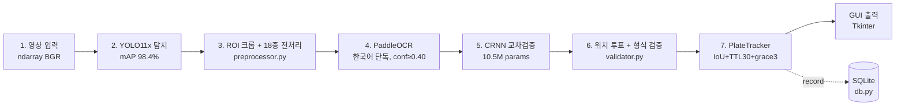
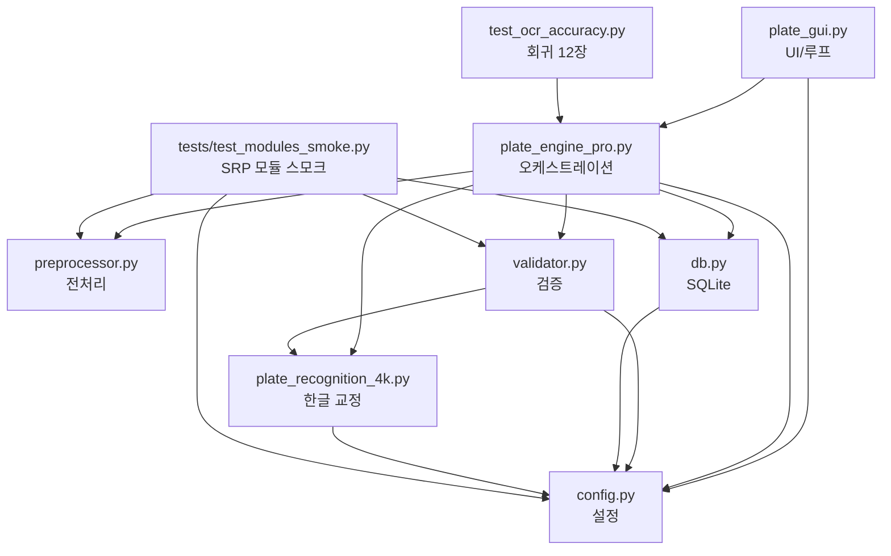
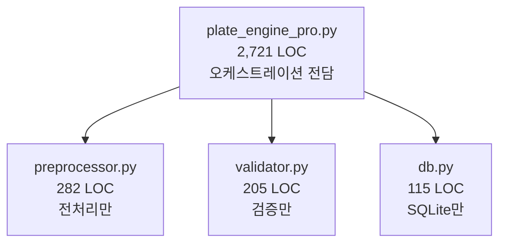
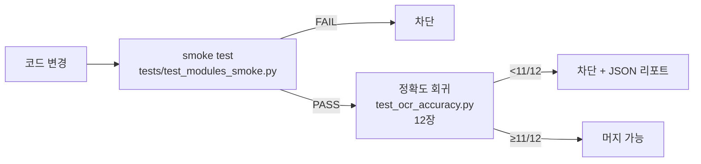

# ARCHITECTURE — 한국 차량 번호판 인식 시스템

> **30초 요약** — YOLO11x로 번호판을 탐지하고, 18종 전처리 × PaddleOCR로 후보를 만들고, CRNN으로 한글을 교차검증해 위치 투표·형식검증·트래커를 거쳐 GUI에 출력한다. 회귀 baseline: 정적 12장 **11/12 (91.7%)**, 실시간 Ghost Detection **5/5 PASS**.

---

## 1. 시스템 개요

| 항목 | 값 |
|---|---|
| 도메인 | 한국 번호판 실시간 인식 (CCTV/대시캠/이미지) |
| 모드 | 정적 이미지 회귀 테스트 + 실시간 영상 GUI |
| 회귀 baseline | **11/12 (91.7%)** — 실패 1건(`58두9599`) 공개 |
| 코드 규모 | 핵심 7 모듈 / 5,560 LOC (테스트 제외) |

---

## 2. 7단계 파이프라인



| 단계 | 책임 | 모듈 | 산출물 타입 |
|---|---|---|---|
| 1 | 프레임 캡처 | `plate_gui.py` (OpenCV `VideoCapture`) | `np.ndarray (H,W,3) uint8 BGR` |
| 2 | 번호판 bbox 탐지 | `plate_engine_pro.PlateEnginePro.detect_only` | `list[dict{bbox, conf}]` |
| 3 | 크롭+업스케일+18종 변형 | `preprocessor.ImagePreprocessor` | `dict[name → ndarray]` (×18) |
| 4 | OCR 추론 | `PlateEnginePro._run_ocr` (PaddleOCR) | `list[tuple[str, float]]` (18 후보) |
| 5 | CRNN 한글 재판독 | `PlateEnginePro._verify_korean_with_crnn` | `str` (교정된 plate) |
| 6 | 자릿수 투표 + 형식 검증 | `validator.PlateValidator` | `str` (확정 plate) 또는 reject |
| 7 | 트랙 매칭 + GUI 렌더 | `PlateEnginePro._ocr_track_cache` + `plate_gui` | `dict{plate, conf, bbox, track_id}` |

---

## 3. 모듈 책임 (T1 분리 후)

> Single Responsibility Principle — God class를 도메인별로 분할. 각 모듈은 한 가지 책임만 진다.

| 모듈 | LOC | 단일 책임 | 외부 의존 |
|---|---:|---|---|
| `plate_gui.py` | 1,658 | UI 루프 / 영상 입력 / 사용자 입력 처리 | tkinter, cv2, PIL |
| `plate_engine_pro.py` | 2,721 | 추론 오케스트레이션 (YOLO + OCR + CRNN + 투표 + 트래커) | ultralytics, paddleocr, torch |
| `plate_recognition_4k.py` | 2,778 | 한글 자모 교정 함수 라이브러리 (순수 함수) | — |
| `preprocessor.py` | **282** | 18종 이미지 전처리 (정적 메서드 모음, stateless) | cv2, numpy |
| `validator.py` | **205** | 한국 번호판 형식·자모 검증 + 패턴 복원 | — (plate_recognition_4k 재사용) |
| `db.py` | **115** | SQLite 기록 + 수배차량(alert) 조회 | sqlite3 |
| `config.py` | 379 | 경로 / 임계값 / OCR / 디스플레이 설정 (4개 dataclass) | — |

**굵게 표시된 3개(preprocessor·validator·db)가 T1 SRP 추출 결과물.**

---

## 4. 의존성 그래프



**관찰:**
- `config.py`는 leaf — 어떤 도메인 모듈도 import하지 않는다 (cycle-free).
- `preprocessor.py`는 프로젝트 내부 모듈을 전혀 import하지 않는다 — **완전히 self-contained / 재사용 가능**.
- `validator.py`·`db.py`는 `config.py`(+ `plate_recognition_4k`)에만 의존 — 단방향 그래프.
- 모든 화살표가 위→아래 한 방향. **순환 의존 없음.**

---

## 5. 데이터 흐름 (Input → Output)

```
영상 파일/카메라
  │
  ▼  cv2.VideoCapture.read() → ndarray (H,W,3) uint8 BGR
[1] Frame
  │
  ▼  PlateEnginePro.detect_only(frame)  ← ultralytics YOLO11x best.pt
[2] Detections : list[{bbox: (x1,y1,x2,y2), conf: float}]
  │
  ▼  ImagePreprocessor.{원본,gray,clahe,sharpen,binary,...}(roi)  × 18종
[3] Variants  : dict[str, ndarray]   (18장 전처리 이미지)
  │
  ▼  PlateEnginePro._run_ocr("paddle", paddle, image)  × 18회
[4] Candidates: list[(text: str, conf: float)]   (PaddleOCR conf ≥ 0.40 필터)
  │
  ▼  PlateEnginePro._verify_korean_with_crnn(paddle_text, roi, ...)
[5] Verified  : str  (CRNN으로 한글 위치만 재판독, 자모 혼동 교정)
  │
  ▼  자릿수별 분해 투표 + PlateValidator.validate(text)
[6] Final     : str  (한국 번호판 형식 통과) 또는 reject
  │
  ▼  track_key = _make_track_key(bbox); _ocr_track_cache[track_key] 업데이트
[7] Tracked   : {plate, confidence, bbox, track_id, ttl=30, grace=3}
  │
  ▼
GUI 렌더링 (Tkinter) + PlateDatabase.record_plate(...) → SQLite
```

---

## 6. Refactoring Journey

### Before — God class (`plate_engine_pro.py` 3,194 LOC)

```mermaid
flowchart TD
    GOD[plate_engine_pro.py<br/>3,194 LOC<br/>YOLO + 전처리 + OCR + CRNN<br/>+ 투표 + 검증 + 트래커 + DB<br/>+ UI helper]
    GOD -.> EVERY[모든 책임]
```

- **문제점**
  - 하나의 모듈에 7단계 + UI helper + DB까지 전부 포함
  - 단위 테스트 불가 (PaddleOCR + YOLO + CRNN 동시 로드 필요)
  - 재사용 불가 (전처리 함수 하나 쓰려 해도 모듈 전체 import)
  - 변경 시 회귀 위험 — 어디가 어디에 영향 주는지 불명확

### After — SRP 분리 (T1 완료, 커밋 `000ef534`)



| 지표 | Before | After | 변화 |
|---|---:|---:|---:|
| `plate_engine_pro.py` 줄 수 | 3,194 | **2,721** | **-473 (-14.8%)** |
| 신규 분리 모듈 | 0 | 3 | preprocessor(282) + validator(205) + db(115) |
| `preprocessor.py` 프로젝트 의존 | — | **0** | self-contained → 재사용 OK |
| 단위 테스트 가능성 | YOLO·PaddleOCR 강결합 | smoke test 분리 실행 OK | `tests/test_modules_smoke.py` |
| 회귀 결과 | 11/12 | **11/12** | 동일 — 기능 보존 입증 |

**시그니처 보존 원칙:** `PlateValidator._COMMERCIAL_CHARS` 등 클래스 상수까지 외부 참조용으로 유지. `plate_engine_pro.py`에서 `# noqa: F401`로 재-export하여 기존 import 경로(`from plate_engine_pro import PlateValidator`)도 호환.

---

## 7. 회귀 보장 메커니즘



| 레이어 | 도구 | 대상 | 실행 시간 | 차단 조건 |
|---|---|---|---:|---|
| L1: 시그니처 보존 | `tests/test_modules_smoke.py` | preprocessor / validator / db | ~1초 | import 실패, 클래스 상수 누락 |
| L2: 정확도 baseline | `test_ocr_accuracy.py` | 정적 12장 GT 매칭 | ~16초 | `passed < 11` (baseline 회귀) |
| L3: Ghost Detection | `test_ghost_detection.py` | 실시간 트래커 시나리오 5종 | — | 잔상 잔류 |
| L4: 실패 자동 리포트 | `test_ocr_accuracy.py --json` | 실패 케이스 단계 분류 | — | JSON에 `hypothesis_stage` 자동 기록 |

**12장 baseline 운영 원칙:** 알려진 실패(`58두9599`) 1건은 README에 공개. 다른 케이스가 무너지면 **즉시 회귀로 간주** — "10/12 → 11/12 + 다른 1건 실패"도 허용 안 함.

---

## 8. 향후 분리 후보 — 로드맵

`plate_engine_pro.py` 2,721 LOC 내부의 다음 5개 도메인을 SRP 후속 분리 대상으로 식별.

| 우선순위 | 모듈 후보 | 현재 위치 | 책임 | 예상 LOC | 비고 |
|---:|---|---|---|---:|---|
| 1 | `ui_text.py` | `plate_engine_pro.py:51` `draw_korean_text` | 한글 PIL 렌더링 헬퍼 | ~60 | 가장 쉬움. 의존성 cv2/PIL만. |
| 2 | `engine_config.py` | `plate_engine_pro.py:113` `PlateEngineConfig` | 엔진 런타임 설정 dataclass | ~30 | `config.py`와 책임 분리 명확. |
| 3 | `crnn_verifier.py` | `plate_engine_pro.py:2192-2407` | `_load_crnn` / `_crnn_read_plate` / `_verify_korean_with_crnn` | ~220 | torch 의존 격리 → CRNN 단독 단위 테스트 가능. |
| 4 | `tracker.py` | `plate_engine_pro.py:312-526` | `_make_track_key` / `_should_skip_ocr` / `_update_ocr_cache` / `_stabilize_track_text` | ~250 | TTL/grace/IoU 매칭 — 가장 가치 높음(테스트 가능성↑). |
| 5 | `multiframe.py` | `plate_engine_pro.py:303` `_composite_multiframe` + 관련 헬퍼 | 다중 프레임 합성 | ~80 | 단독 분리 시 효과 가장 작음 — 후순위. |

**달성 시 목표:** `plate_engine_pro.py` ≤ 2,100 LOC, 순수 오케스트레이션만 남기고 모든 도메인 로직을 단일 책임 모듈로 위임.

---

## 부록 — 빠른 진입점

```bash
# 동작 확인 (16초)
python test_ocr_accuracy.py            # → 11/12 (91.7%) 기대

# SRP 분리 모듈 스모크 (1초)
pytest tests/test_modules_smoke.py     # → PASS

# 실시간 GUI
python plate_gui.py                    # 기본 영상 자동 로드
python plate_gui.py movie/hiway.mp4    # 특정 영상

# 변경 후 회귀 검증 순서
pytest tests/test_modules_smoke.py && python test_ocr_accuracy.py
```
